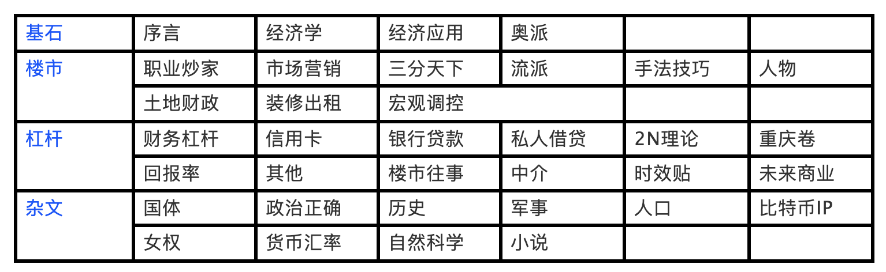

# 水库论坛-欧神文集
《水库论坛》所有文章总和，它环环相扣、忠言逆耳，其实它的本质就是一整套平民房产投资创富人生升阶的秘笈。这套秘笈会随着岁月的流逝而自动更新！因为它是一位亿万身家的资深房产投资人穷其一生“所闻、所历、所感、所悟”撰写而出的——生命不息、更新不止！因为《水库论坛》很多实战案例都是承前启后，许多文章更是环环相扣的，所以文章与文章之间的“引用”经常出现。那么阅读文章需要有一个“先后顺序”所以做一个下面的“导读目录”显得尤为重要。

## 序言

### [水库羊年贺禧 ------ 毁三观，竖新生 #1](/books/shuiku/pages/1)

### [大道随行，不忘本心 #10](/books/shuiku/pages/10)

### [经济学 #20](/books/shuiku/pages/20)

### [无风险套利 #30](/books/shuiku/pages/30)

### [世界观，价值观，人生观#37](/books/shuiku/pages/37)

### [大纲的困扰 #40](/books/shuiku/pages/40)
## 经济学底层

### [经济学第一定律 #50](/books/shuiku/pages/50)

### [生产与抢劫 #60](/books/shuiku/pages/60)

### [政治学第一定律 #70](/books/shuiku/pages/70)

### [经济学第二定律 #72](/books/shuiku/pages/72)

### [经济学第三定律 #75](/books/shuiku/pages/75)

### [与无政资谭叔的对答 #F580](/books/shuiku/pages/F580)

### [正本清源说奥派 #F1170](/books/shuiku/pages/F1170)

### [富国强民-中国的财富 #2110](/books/shuiku/pages/2110)

### [交易产生财富-什么才是真正的财富 #1570](/books/shuiku/pages/1570)

### [正本清源说奥派（4）---- 有限理性 #F1170](/books/shuiku/pages/F1170-4)

### [正本清源说奥派（5）----田园奥派 #F1170](/books/shuiku/pages/F1170-5)

### [正本清源说奥派（6）---- 竞争与淘汰 #F1170](/books/shuiku/pages/F1170-6)

### [正本清源说奥派（7）---- 反女权宣言 #F1170](/books/shuiku/pages/F1170-7)

### [正本清源话通缩#F1175](/books/shuiku/pages/F1175)

### [经济学的精髓 #F1160](/books/shuiku/pages/F1160)

### [经济学中的“搭便车”现象#F1900](/books/shuiku/pages/F1900)

### [什么才是宏观经济学#F1970](/books/shuiku/pages/F1970)

### [“内需不足”是野鸡伪科学 #F1980](/books/shuiku/pages/F1980)
## 经济学应用

### [高速公路免费是极恶之事 #F340](/books/shuiku/pages/F340)

### [公路的彻底收费化#F1640](/books/shuiku/pages/F1640)

### [牛奶为什么要倒河里 #F1350](/books/shuiku/pages/F1350)

### [空置税可以降低房价么 #1500](/books/shuiku/pages/1500)

### [没有合同不公平 #1350](/books/shuiku/pages/1350)

### [为什么亏损而不倒闭 #F670](/books/shuiku/pages/F670)

### [职业分布决定中产分布 #F230](/books/shuiku/pages/F230)

### [税收真的能「劫富济贫」吗？#F250](/books/shuiku/pages/F250)

### [论生产过剩 #F320](/books/shuiku/pages/F320)

### [论买不起 #F330](/books/shuiku/pages/F330)

### [所有私营企业，不适用歧视原则 #F1100](/books/shuiku/pages/F1100)

### [没有买卖，就有杀戮 #F1150](/books/shuiku/pages/F1150)

交易四篇

### [旗帜鲜明的支持裸条 #F740](/books/shuiku/pages/F740)

### [“信息不对称”是伪科学 #F750](/books/shuiku/pages/F750)

### [裸条没有外部性 #F760](/books/shuiku/pages/F760)

### [比交易更底层的东西 #F780](/books/shuiku/pages/F780)

### [Master不是人工智能 #F830](/books/shuiku/pages/F830)

### [AI会导致失业潮么 #F1020](/books/shuiku/pages/F1020)

### [程序员会不会失业#F2140](/books/shuiku/pages/F2140)

### [书籍时代的消亡 #F1060](/books/shuiku/pages/F1060)

### [读书时代的消亡#F1690](/books/shuiku/pages/F1690)

### [Smartpass的赢利模式 #F1070](/books/shuiku/pages/F1070)

### [上海没有错失互联网#F1480](/books/shuiku/pages/F1480)

### [婚姻法新解释，市场震惊#1680](/books/shuiku/pages/1680)

### [尾部效应#1690](/books/shuiku/pages/1690)

### [为什么滨州那么穷，为什么香港那么富#F1550](/books/shuiku/pages/F1550)

### [刷GDP的高手#F1560](/books/shuiku/pages/F1560)

### [荷兰效应#F1570](/books/shuiku/pages/F1570)

### [增长在哪里#F1670](/books/shuiku/pages/F1670)

### [同化在哪里#F1680](/books/shuiku/pages/F1680)

### [金融政策为什么失效#1750](/books/shuiku/pages/1750)

### [携程提价，该不该谴责#F1700](/books/shuiku/pages/F1700)

### [我命令，把钱赶到实体经济#1800](/books/shuiku/pages/1800)
## Libertarian

### [邪恶的媒体 #80](/books/shuiku/pages/80)

### [你的产证，不是你的房子 #1390](/books/shuiku/pages/1390)

### [旗帜鲜明地支持百度，反对魏则西 #F370](/books/shuiku/pages/F370)

### [兰博基尼工程师得花多少年才能买一辆Lamborghini#F650](/books/shuiku/pages/F650)

### [如是我观，知识产权 #F520](/books/shuiku/pages/F520)

### [评估的价格是客观吗 #F570](/books/shuiku/pages/F570)

### [自由主义的吸毒观 #F680](/books/shuiku/pages/F680)

### [旗帜鲜明地支持百度，反对魏则西 #F370](/books/shuiku/pages/F370)

### [兰博基尼工程师得花多少年才能买一辆Lamborghini#F650](/books/shuiku/pages/F650)

### [如是我观，知识产权 #F520](/books/shuiku/pages/F520)

### [评估的价格是客观吗 #F570](/books/shuiku/pages/F570)

### [骗子横行的水库 #F660](/books/shuiku/pages/F660)

### [自由主义的吸毒观 #F680](/books/shuiku/pages/F680)

### [中华武林人才凋零 #F1090](/books/shuiku/pages/F1090)

### [亲爹给你的教育 #F1310](/books/shuiku/pages/F1310)

### [不公平地揍人#F340](/books/shuiku/pages/F1340)

### [欧美国家可以拒绝非法移民么#F1380](/books/shuiku/pages/F1380)

### [即将到来的中产阶级社会#F1390](/books/shuiku/pages/F1390)

### [你想要怎样的圣诞礼物 #1630](/books/shuiku/pages/1630)

### [六百万个傻瓜#F1590](/books/shuiku/pages/F1590)

### [桥水报告#F1620](/books/shuiku/pages/F1620)

### [主角般的成功#F1650](/books/shuiku/pages/F1650)

### [海草，海草#F1660](/books/shuiku/pages/F1660)

### [小白领的宁死不从#F1740](/books/shuiku/pages/F1740)

### [世上本应没有税#F1800](/books/shuiku/pages/F1800)

### [玄门内功心法#F1850](/books/shuiku/pages/F1850)

### [做慈善和真慈善#F1920](/books/shuiku/pages/F1920)

### [房价下跌天下毒#1940](/books/shuiku/pages/1940)

### [三无谣言#1950](/books/shuiku/pages/1950)

### [每一分捐钱都是错误的 #NN1](/books/shuiku/pages/NN1)
## 职业炒家

###  [职业炒家（一）#130](/books/shuiku/pages/130)

###  [职业炒家（二）------ 实业之殇 #140](/books/shuiku/pages/140)

###  [职业炒家（三）----- 正义感 #C150](/books/shuiku/pages/C150)

###  [职业炒家（四）----- 买进 #160](/books/shuiku/pages/160)

###  [职业炒家（五）---- 升值#170](/books/shuiku/pages/170)

###  [温州炒房团 #180](/books/shuiku/pages/180)

###  [职业炒家（六）---- 卖出 #190](/books/shuiku/pages/190)

###  [炒楼业的忌讳 #192](/books/shuiku/pages/192)

###  [天下岂有此等炒房团 #1560](/books/shuiku/pages/1560)

###  [被遗弃，被抛弃的B2C #1600](/books/shuiku/pages/1600)

###  [粉耳朵 #1650](/books/shuiku/pages/1650)
## Marketing

### [市场营销入门 #210](/books/shuiku/pages/210)

### [Re-Sale为什么这么难 #220](/books/shuiku/pages/220)

### [如何运营一家企业 #230](/books/shuiku/pages/230)

### [无中生有的高阶 #240](/books/shuiku/pages/240)

### [夏洛特烦恼 | 精准营销的胜利 #F240](/books/shuiku/pages/F240)

### [美国大片加速走向屌丝化 #F1030](/books/shuiku/pages/F1030)

### [老婆喊我组装自行车 #F390](/books/shuiku/pages/F390)

### [从包粽子机说起 #F1120](/books/shuiku/pages/F1120)

### [怎样把品牌做死掉 #F1180](/books/shuiku/pages/F1180)

### [水库赚钱之道 #F1190](/books/shuiku/pages/F1190)

### [广告学入门（上）#1640](/books/shuiku/pages/1640)

### [广告学入门（中）#1641](/books/shuiku/pages/1641)

### [广告学入门（下）#1642](/books/shuiku/pages/1642)

### [中产就是接盘侠#F1750](/books/shuiku/pages/F1750)

### [怎样判断最后一棒#F1760](/books/shuiku/pages/F1760)

### [几类投资市场的分析#F1770](/books/shuiku/pages/F1770)

### [团结起来，反抗邪恶的头条#F1780](/books/shuiku/pages/F1780)

### [恶的土壤，结不出善的头条#F1790](/books/shuiku/pages/F1790)

### [买房子是消费降级么#1880](/books/shuiku/pages/1880)

### [炼金之术#F1930](/books/shuiku/pages/F1930)

### [marketing涨价急先锋#F1960](/books/shuiku/pages/F1960)

### [销售和营销和剩女#F2010](/books/shuiku/pages/F2010)

### [楼市的科技树被锁死了么#1970](/books/shuiku/pages/1970)
## 上海楼市三分天下

### [上海楼市的三分天下 #250](/books/shuiku/pages/250)

### [屌丝时代（上） #260](/books/shuiku/pages/260)

### [屌丝时代（下） #270](/books/shuiku/pages/270)

### [迎接一个波澜壮阔的大时代 #280](/books/shuiku/pages/280)

### [新城不是希望 #290](/books/shuiku/pages/290)

### [屌丝购房手册（一）#300](/books/shuiku/pages/300)

### [屌丝购房手册（二）----以力破巧 #309](/books/shuiku/pages/309)

### [屌丝购房手册（三） #320](/books/shuiku/pages/320)

### [处房情结（一）#330](/books/shuiku/pages/330)

### [处房情结（二）#340](/books/shuiku/pages/340)

### [处房情结（三）----增量和存量 #350](/books/shuiku/pages/350)

### [新城之莘庄模式 #360](/books/shuiku/pages/360)

### [劳动人民购房手册 #370](/books/shuiku/pages/370)

### [外国人购房手册 #380](/books/shuiku/pages/380)

### [小众市场 #390](/books/shuiku/pages/390)

### [沉默的上海人 #400](/books/shuiku/pages/400)

### [沉默的上海人（二）#410](/books/shuiku/pages/410)

### [老公房之政治特权#420](/books/shuiku/pages/420)

### [3000万富翁每天可以花多少钱#4020](/books/shuiku/pages/4020)

### [新一轮经济周期似已到来#4040](/books/shuiku/pages/4040)

### [中国会是最后一个工业化国家么#4050](/books/shuiku/pages/4050)

### [七十年产权好，还是永久产权好#4060](/books/shuiku/pages/4060)

### [房圈这二三年#4070](/books/shuiku/pages/4070)
## 炒房客的流派 

###  [炒房客的流派 #460](/books/shuiku/pages/460)

###  [炒房客的流派（二） #470](/books/shuiku/pages/470)

###  [炒房客的流派（三）---法租民宿派 #480](/books/shuiku/pages/480)

###  [炒房客的流派（四）-----药单流 #490](/books/shuiku/pages/490)

###  [炒房客的流派（五）----周转流 #500](/books/shuiku/pages/500)

###  [炒房客的流派（六七）---- 疯魔流和转租流 #510](/books/shuiku/pages/510)

###  [炒房客的流派（八）----失败者 #520](/books/shuiku/pages/520)

###  [流派终结者 #530](/books/shuiku/pages/530)

###  [列兵和阶层 #540](/books/shuiku/pages/540)
## 手法和技巧

###  [楼市的季节性现象 #630](/books/shuiku/pages/630)

###  [三重顶 #640](/books/shuiku/pages/640)

###  [售出清单 #650](/books/shuiku/pages/650)

###  [学区房的大风险 #1130](/books/shuiku/pages/1130)

###  [ABC单 #1210](/books/shuiku/pages/1210)

###  [xyz单 #1270](/books/shuiku/pages/1270)

###  [慢节奏和快节奏 #1360](/books/shuiku/pages/1360)

###  [合伙买房手册 #1380](/books/shuiku/pages/1380)

###  [家乡的毒药酒 #1470](/books/shuiku/pages/1470)

###  [代持操作手册 #1610](/books/shuiku/pages/1610)

###  [代持分支科技树 #1615](/books/shuiku/pages/1615)

###  [拖延流 #1620](/books/shuiku/pages/1620)

###  [众筹买房手册 #1670](/books/shuiku/pages/1670)

###  [鹰鸽转换 #1890](/books/shuiku/pages/1890)

###  [储蓄平方米 #1920](/books/shuiku/pages/1920)

###  [应激反应 #1930](/books/shuiku/pages/1930)
## 人物与八卦

### [我想要不平凡的人生（上） #F1230 ](/books/shuiku/pages/F1230 )

### [我想要不平凡的人生（下） #F1240](/books/shuiku/pages/F1240)

### [格调（上） #F870](/books/shuiku/pages/F870)

### [格调（下）#F890](/books/shuiku/pages/F890)

### [多军手顺择偶观 #F1040](/books/shuiku/pages/F1040)

### [对不起，我不会#F1360](/books/shuiku/pages/F1360)

### [男人是张信用卡#F1470](/books/shuiku/pages/F1470)

### [亲爹啊，我尽孝了#F1490](/books/shuiku/pages/F1490)

### [眼界那些小事#F1580](/books/shuiku/pages/F1580)

### [自媒体那些小事#F1610](/books/shuiku/pages/F1610)

### [天才语文#F1630](/books/shuiku/pages/F1630)

### [霍官泰和他的楼花#1771](/books/shuiku/pages/1771)

### [家里在一二线城市有很多套房是怎么的一种体验？#1870](/books/shuiku/pages/1870)

### [真正的铁饭碗#F1870](/books/shuiku/pages/F1870)

### [A9消费观#F1890](/books/shuiku/pages/F1890)

### [清北学生在哈耶普面前有没有自卑感#F1940](/books/shuiku/pages/F1940)

### [嫁豪门的忌讳#F2020](/books/shuiku/pages/F2020)

### [水库相亲#1000](/books/shuiku/pages/1000)

### [你的眼中写着怯懦#1960](/books/shuiku/pages/1960)

## 城市规划导论

###  [从来不存在“土地财政” #292](/books/shuiku/pages/292)

###  [城市规划导论 #580](/books/shuiku/pages/580)

###  [城市规划导论（二）------不可预测 #590](/books/shuiku/pages/590)

###  [城市规划导论（三）----- 可以预测 #600](/books/shuiku/pages/600)

###  [城市规划导论（四）------板块轮动 #610](/books/shuiku/pages/610)

###  [城市规划导论（五）-----重心 #620](/books/shuiku/pages/620)

###  [职业炒家会杀向雄安么 #1290](/books/shuiku/pages/1290)

###  [999年358天 #1300](/books/shuiku/pages/1300)

###  [房地产市场的二朵乌云（上） #2520](/books/shuiku/pages/2520)

###  [房地产市场的二朵乌云（下） #2530](/books/shuiku/pages/2530)

###  [支离破碎的北京市场 #2540](/books/shuiku/pages/2540)

###  [降维攻击 #1310](/books/shuiku/pages/1310)

###  [楼市的生命周期（上） #1440](/books/shuiku/pages/1440)

###  [楼市的生命周期（下） #1450](/books/shuiku/pages/1450)

###  [漳州炒房团，请不要再造谣了 #1320](/books/shuiku/pages/1320)

###  [农村土地有投资价值么 #1660](/books/shuiku/pages/1660)

###  [螳螂捕蝉的朝鲜楼市 #1760](/books/shuiku/pages/1760)

###  [一个月睡醒来 #1860](/books/shuiku/pages/1860)

## 装修和租赁

###  [世界上最好的房型 #430](/books/shuiku/pages/430)

###  [世界上最好的房型（2）#440](/books/shuiku/pages/440)

###  [买卖是买卖，租赁是租赁 #450](/books/shuiku/pages/450)

###  [装修基础知识概念 #2550](/books/shuiku/pages/2550)

###  [凤变冰入门 #2560](/books/shuiku/pages/2560)

###  [租售同权，租售同艰难 #F1210](/books/shuiku/pages/F1210)

###  [买卖贵，还是租赁贵 #1510](/books/shuiku/pages/1510)

###  [不再卖房的未来 #1520](/books/shuiku/pages/1520)

###  [匪夷所思的房租贷款 #1580](/books/shuiku/pages/1580)

## 宏观调控卷：

###  [宏观调控卷 -----序章 #660](/books/shuiku/pages/660)

###  [中二病 #670](/books/shuiku/pages/670)

###  [第一次宏观调控（上） #680](/books/shuiku/pages/680)

###  [第一次宏观调控（下） #690](/books/shuiku/pages/690)

###  [营业税的外围世界 #700](/books/shuiku/pages/700)

###  [所得税和土增税 #710](/books/shuiku/pages/710)

###  [杀死商铺 #720](/books/shuiku/pages/720)

###  [土增税对工商业的破坏（上） #730](/books/shuiku/pages/730)

###  [土增税对工商业的破坏（下） #740](/books/shuiku/pages/740)

###  [第三轮宏观调控（上） #750](/books/shuiku/pages/750)

###  [第三轮宏观调控（下） #760](/books/shuiku/pages/760)

###  [二阶经济学 #770](/books/shuiku/pages/770)

###  [内陆人心的正义 #775](/books/shuiku/pages/775)

###  [“不给钱”的经济适用房 #780](/books/shuiku/pages/780)

###  [绝望的县官 #790](/books/shuiku/pages/790)

###  [免费的才是最贵的 #800](/books/shuiku/pages/800)

###  [7090理想世界 #810](/books/shuiku/pages/810)

###  [差异化信贷 #820](/books/shuiku/pages/820)

###  [准备金率和地下钱庄 #830](/books/shuiku/pages/830)

###  [加息岂能降房价 #840](/books/shuiku/pages/840)

###  [从来不存在四万亿 #850](/books/shuiku/pages/850)

###  [限贷的危害 #860](/books/shuiku/pages/860)

###  [车匪路霸话限购 #870](/books/shuiku/pages/870)

###  [限购的毒药 #880](/books/shuiku/pages/880)

###  [交易成本有多高（上） #900](/books/shuiku/pages/900)

###  [交易成本有多高（下）------ 压价效应 #910](/books/shuiku/pages/910)

###  [重压之下，生存之道 #920](/books/shuiku/pages/920)

###  [炒楼业黄金时代 #930](/books/shuiku/pages/930)

###  [回忆那些楼市成交的黄金岁月 #F350](/books/shuiku/pages/F350)

###  [减调控 #940](/books/shuiku/pages/940)

###  [吃毒药涨内力 #950](/books/shuiku/pages/950)

###  [既得利益集团 #960](/books/shuiku/pages/960)

###  [逼空式上涨 #1040](/books/shuiku/pages/1040)

###  [京沪楼市何时见顶（上） #1050](/books/shuiku/pages/1050)

###  [京沪楼市何时见顶（下） #1060](/books/shuiku/pages/1060)

###  [上海楼市的实际价值 #1070](/books/shuiku/pages/1070)

###  [泡沫分水岭 #1080](/books/shuiku/pages/1080)

###  [赔率胜负手 #1090](/books/shuiku/pages/1090)

###  [假设调控取消 #1100](/books/shuiku/pages/1100)

###  [帝国的砒霜---房产税 #1110](/books/shuiku/pages/1110)

###  [不征房产税，凭什么为什么 #1120](/books/shuiku/pages/1120)

###  [我也很绝望啊 #1280](/books/shuiku/pages/1280)

###  [全款的请向里走 #F1290](/books/shuiku/pages/F1290)

###  [什么样的人，会去炒丹东 #1820](/books/shuiku/pages/1820)

###  [世上再无商品房 #1830](/books/shuiku/pages/1830)

###  [商品化和强国之路 #1840](/books/shuiku/pages/1840)

## 财务杠杆

###  [Section 2 筑基卷总纲 #2000](/books/shuiku/pages/2000)

###  [发财的数量级 #2010](/books/shuiku/pages/2010)

###  [爬阶基础概念 #2020](/books/shuiku/pages/2020)

###  [业绩的上限 #2030](/books/shuiku/pages/2030)

###  [更多更早的金钱 #2040](/books/shuiku/pages/2040)

###  [焚城烈火征粮队 #2050](/books/shuiku/pages/2050)

###  [第一个一千万 #2060](/books/shuiku/pages/2060)

###  [楼市的回报有多高 #2070](/books/shuiku/pages/2070-1)

###  [长线负债率 #2080](/books/shuiku/pages/2080)

###  [准备借钱 #2090](/books/shuiku/pages/2090)

###  [高利率时代 #1790](/books/shuiku/pages/1790)

## 信用卡

###  [信用卡是什么 #2100](/books/shuiku/pages/2100)

###  [信用卡的正确用法 #2110](/books/shuiku/pages/2110-1)

###  [开始办卡 #2120](/books/shuiku/pages/2120)

###  [积分流基础知识 #2130](/books/shuiku/pages/2130)

###  [撸卡积分流 #2140](/books/shuiku/pages/2140)

###  [借款流基础概念 #2150](/books/shuiku/pages/2150)

###  [空当接龙 #2160](/books/shuiku/pages/2160)

###  [信用卡之雕虫小道 #2170](/books/shuiku/pages/2170)

###  [信用卡之分期 #2180](/books/shuiku/pages/2180)

###  [信用卡之旁门左道 #2190](/books/shuiku/pages/2190)

###  [银行的脸谱（上）#2200](/books/shuiku/pages/2200)

###  [银行的脸谱（下）#2210](/books/shuiku/pages/2210)

###  [信用卡的战略意义 #2220](/books/shuiku/pages/2220)

## 银行贷款

###  [从小数点揭示的财富信息 #2230](/books/shuiku/pages/2230)

###  [资金的分层（上） #2240](/books/shuiku/pages/2240)

###  [资金的分层（下） #2250](/books/shuiku/pages/2250)

###  [炒家的资金成本 #2260](/books/shuiku/pages/2260)

###  [利率与房价的精算法 #2270](/books/shuiku/pages/2270)

###  [贷款选择的精算法 #2280](/books/shuiku/pages/2280)

###  [近期新型贷款产品精算 #2285](/books/shuiku/pages/2285)

###  [零首付精算法 #2290](/books/shuiku/pages/2290)

###  [杠杆与笋盘哪个更重要 #2295](/books/shuiku/pages/2295)

###  [评估公司一二三 #2300](/books/shuiku/pages/2300)

###  [网签和贷控 #2310](/books/shuiku/pages/2310)

###  [抵押贷款一二三 #2320](/books/shuiku/pages/2320)

###  [截断和再抵押 #2330](/books/shuiku/pages/2330)

###  [对敲 #2340](/books/shuiku/pages/2340)

###  [贷款的外围世界（上） #2350](/books/shuiku/pages/2350)

###  [贷款的外围世界（下） #2360](/books/shuiku/pages/2360)

###  [一些基础财务函数 #2370](/books/shuiku/pages/2370)

###  [我们需要多少年还清贷款 #2460](/books/shuiku/pages/2460)

###  [贷款应该是收入的多少倍 #2470](/books/shuiku/pages/2470)

###  [公积金的用法 #2480](/books/shuiku/pages/2480)

###  [流动性的黄昏 #2490](/books/shuiku/pages/2490)

###  [我是怎样一眼识破假流水的 #1330](/books/shuiku/pages/1330)

###  [炒房中的保险 #2500](/books/shuiku/pages/2500)

###  [社保划算，还是商业保险划算 #F1130](/books/shuiku/pages/F1130)

###  [航母理论 #2510](/books/shuiku/pages/2510)

## 私人借贷：

###  [浅谈现金管理入门 #2380](/books/shuiku/pages/2380)

###  [高利贷知识入门 #2390](/books/shuiku/pages/2390)

###  [借钱的人情世界 #2400](/books/shuiku/pages/2400)

###  [短借的场合 #2410](/books/shuiku/pages/2410)

###  [针刺效应 #2420](/books/shuiku/pages/2420)

###  [杂食与多核 #2430](/books/shuiku/pages/2430)

###  [杂食与多核之读后感 #2440](/books/shuiku/pages/2440)

## 2N理论

###  [浅谈炒楼2N定理 #2570](/books/shuiku/pages/2570)

###  [你的第一第二套房子 #2580](/books/shuiku/pages/2580)

###  [获得家人的支持 #2590](/books/shuiku/pages/2590)

###  [五套六套走向职业化 #2600](/books/shuiku/pages/2600)

###  [七套八套高成本资金 #2610](/books/shuiku/pages/2610)

###  [九套十套山穷水尽 #2620](/books/shuiku/pages/2620)

###  [2N之通关 #2630](/books/shuiku/pages/2630)

## 《下一站·重庆》

### [《下一站·重庆》序言 #2640](/books/shuiku/pages/2640)

### [《下一站·重庆》（上）#2650](/books/shuiku/pages/2650)

### [《下一站·重庆》（中）#2660](/books/shuiku/pages/2660)

### [《下一站·重庆》（下）#2670](/books/shuiku/pages/2670)

### [我对重庆的态度 #2680](/books/shuiku/pages/2680)

### [婆罗门的世界 #2690](/books/shuiku/pages/2690)

### [异大陆的审美观 #2700](/books/shuiku/pages/2700)

### [重庆实战手册 #2710](/books/shuiku/pages/2710)

### [重庆楼市地段分析 #2720](/books/shuiku/pages/2720)

### [重庆楼市地段分析 #2720](/books/shuiku/pages/2720)

### [重庆部分楼盘点评 #2740](/books/shuiku/pages/2740)

### [二线城市的切入点 #2750](/books/shuiku/pages/2750)

### [关于“重庆管家有限公司”的设想 #F800](/books/shuiku/pages/F800)

## 回报率

###  [回报率的真相 #90](/books/shuiku/pages/90)

###  [你赚我息，我赚你本 #100](/books/shuiku/pages/100)

###  [回报率的误解 #110](/books/shuiku/pages/110)

###  [有利益的地方，就有犯规 #F260](/books/shuiku/pages/F260)

###  [万世不移的财富#120](/books/shuiku/pages/120)

###  [套利与套险 #3120](/books/shuiku/pages/3120)

###  财富三篇

###  [中国的财富 #3210](/books/shuiku/pages/3210)

###  [向上爬 #3220](/books/shuiku/pages/3220)

###  [权力啊，北京 #3230](/books/shuiku/pages/3230)

###  [什么才是真正的财富 #1570](/books/shuiku/pages/1570)

###  [负利率下的资产模型 #F450](/books/shuiku/pages/F450)

###  [价格（一）----- 三维价格 #550](/books/shuiku/pages/550)

###  [价格（二）-----搭桥 #560](/books/shuiku/pages/560)

###  [价格（三）----- 框架 #570](/books/shuiku/pages/570)

###  [股市骗局（一）----- 增长 #2910](/books/shuiku/pages/2910)

###  [股市骗局（二）----- 回报率 #2920](/books/shuiku/pages/2920)

###  [股市骗局（三）----- 估值 #2930](/books/shuiku/pages/2930)

###  [证券化的威力 #2935](/books/shuiku/pages/2935)

###  [投机的一些基本原理 #3250](/books/shuiku/pages/3250)

###  [合伙做生意的641 #F2080](/books/shuiku/pages/F2080)

###  [股市估值点 641 #F2090](/books/shuiku/pages/F2090)

###  [肮脏的收藏业 #F2100](/books/shuiku/pages/F2100)

## 财务和其他

### [可以做空房产么 #1480](/books/shuiku/pages/1480)

### [创业指南ABC#1490](/books/shuiku/pages/1490)

### [财富追赶问题 #2450](/books/shuiku/pages/2450)

### [《楼市秘籍》速成篇 #2760](/books/shuiku/pages/2760)

### [《楼市秘籍》速成法备注 #2770](/books/shuiku/pages/2770)

### [论库存的理解和分析 #3240](/books/shuiku/pages/3240)

### 烂盘你就喊出来#1460

### [办公室里的龙虎斗 #F1320](/books/shuiku/pages/F1320)

### [双鱼座为什么不能炒菜 #F1140](/books/shuiku/pages/F1140)

### [以房养老设计手册#1910](/books/shuiku/pages/1910)

## 上海楼市往事

###  [上海楼市往事（1）年轻人的战点 #1140](/books/shuiku/pages/1140)

###  [上海楼市往事（2）1998年的楼市 #1150](/books/shuiku/pages/1150)

###  [上海楼市往事（3）天下无敌的公司 #1160](/books/shuiku/pages/1160)

###  [上海楼市往事（4）入行 #1180](/books/shuiku/pages/1180)

###  [上海楼市往事（5）上海地段历史 #1190](/books/shuiku/pages/1190)

###  [上海楼市往事（6）鬼魅伎俩 #1200](/books/shuiku/pages/1200)

###  [上海楼市往事（7）白左上台 #1230](/books/shuiku/pages/1230)

###  [上海楼市往事（8）隐士和江湖 #1240](/books/shuiku/pages/1240)

###  [上海楼市往事（9）第一个壹仟万 #NN4](/books/shuiku/pages/NN4)

###  [上海楼市的真实走势（一） #990](/books/shuiku/pages/990)

###  [上海楼市的真实走势（二）----双线 #1010](/books/shuiku/pages/1010)

###  [上海楼市的真实走势（三）------幻相 #1020](/books/shuiku/pages/1020)

###  [上海楼市的真实走势（四）----观望 #1030](/books/shuiku/pages/1030)

###  [香港楼市崩盘始末（上） #970](/books/shuiku/pages/970)

###  [香港楼市崩盘始末（下） #980](/books/shuiku/pages/980)

## 中介篇

###  [中介篇（一） #2940](/books/shuiku/pages/2940)

###  [中介篇（二）----房源 #2950](/books/shuiku/pages/2950)

###  [中介篇（三）----欺骗 #2960](/books/shuiku/pages/2960)

###  [中介篇（四）----买入 #2970](/books/shuiku/pages/2970)

###  [新兴服务业---管家公司（一） #1700](/books/shuiku/pages/1700)

###  [管家行业的商业原理 #1710](/books/shuiku/pages/1710)

###  [亏钱的地产生意 #1720](/books/shuiku/pages/1720)

###  [管家的公司架构 #1730](/books/shuiku/pages/1730)

## 时效分析：

###  [2016.10月调控政策的分析 #1125](/books/shuiku/pages/1125)

###  [2016.10月调控政策的分析（市场经济版） #1126](/books/shuiku/pages/1126)

###  [2016.11.28上海调控政策分析 #1135](/books/shuiku/pages/1135)

###  [2017.03.17北京调控政策分析 #1260](/books/shuiku/pages/1260)

###  [yevon_ou对2017楼市的判断（2017/4/18）]

###  [yevon_ou对2018楼市的判断（2018/4/18）](/books/shuiku/pages/NN5)

###  [2016.11.27人文经济学会演讲稿 #F720]

###  [人文经济学会演讲问答 #F730](/books/shuiku/pages/F730)

###  [近期分答问题荟萃 #1220](/books/shuiku/pages/1220)

###  [近期小密圈问题荟萃 #1340](/books/shuiku/pages/1340)

###  [小密圈问题荟萃五月（上） #1410](/books/shuiku/pages/1410)

###  [小密圈问题荟萃五月（下）#1420](/books/shuiku/pages/1420)

###  [水库微信号分析2017版 #1590](/books/shuiku/pages/1590)

###  [天津楼市看淡 #1810](/books/shuiku/pages/1810)

###  [个税减税，房产登记和股市大跌 #F1840](/books/shuiku/pages/F1840)

## 未来商业

###  [当商业升到满级 #1430](/books/shuiku/pages/1430)

###  [大城市的生生死死 #1530](/books/shuiku/pages/1530)

###  [未来的大城市 #1540](/books/shuiku/pages/1540)

###  [把商铺干掉吧 #1550](/books/shuiku/pages/1550)

###  [迁徙力 #F1330](/books/shuiku/pages/F1330)

###  [写给2035年的他 #F1810](/books/shuiku/pages/F1810)

###  [学徒制的返潮 #F2060](/books/shuiku/pages/F2060)

## 国体

### [社会因何而存在](/books/shuiku/pages/)

### [儒家](/books/shuiku/pages/)

### [法·禅宗](/books/shuiku/pages/)

### [基督自治](/books/shuiku/pages/)

### [神的战争](/books/shuiku/pages/)

### [道教的复兴](/books/shuiku/pages/)

### [侧记](/books/shuiku/pages/)

### [一个马基雅弗利主义者和自由主义的决裂 #F20](/books/shuiku/pages/F20)

### [工业革命和市场经济#F30](/books/shuiku/pages/F30)

### [什么是左翼，什么是右翼 #F420](/books/shuiku/pages/F420)

### [（上卷）历史](/books/shuiku/pages/)

### [（下卷）欧洲的灭亡](/books/shuiku/pages/)

### [论高等收入国家陷阱 #F480](/books/shuiku/pages/F480)

### [美国的大脑生病了（上） #F490](/books/shuiku/pages/F490)

### [美国的大脑生病了（下） #F500](/books/shuiku/pages/F500)

### [天赋零权 #F510 ](/books/shuiku/pages/F510 )

### [美国时代的终结 #F530](/books/shuiku/pages/F530)

### [以德报怨 #F550](/books/shuiku/pages/F550)

### [正义暂获小胜，前途依然坎坷 #F710](/books/shuiku/pages/F710)

### [但丁密码 #F700](/books/shuiku/pages/F700)

### [论娼妓，芭蕾，征服，和暴郑 #200](/books/shuiku/pages/200)

### [恒纪元与乱纪元#F840](/books/shuiku/pages/F840)

### [谁在抹黑“地方债”#F270](/books/shuiku/pages/F270)

### [王冠的奥秘#F280](/books/shuiku/pages/F280)

### [外藩的奥秘#F470](/books/shuiku/pages/F470)

### [论组织资源#F310](/books/shuiku/pages/F310)

### [量子退火效应 #F1220](/books/shuiku/pages/F1220)

### [袖里藏刀#F1430](/books/shuiku/pages/F1430)

### [君子为什么总斗不过小人#F1510](/books/shuiku/pages/F1510)

### [逢年过节的必要性#F1520](/books/shuiku/pages/F1520)

### [春晚可以不挨骂吗#F1530](/books/shuiku/pages/F1530)

### [刑名不具#F1730](/books/shuiku/pages/F1730)

### [加速度的公平#F1860](/books/shuiku/pages/F1860)

### [效率和稳定#F1880](/books/shuiku/pages/F1880)

## 白左

### [从一碗回汉拉面说起 #F600](/books/shuiku/pages/F600)

### [慈善为何变成恶行 #F610](/books/shuiku/pages/F610)

### [为什么是金融和IT#F620](/books/shuiku/pages/F620)

### [特朗普减税案#F1410](/books/shuiku/pages/F1410)

### [我们会信奉邪魔么#F900](/books/shuiku/pages/F900)

### [谁是罪犯圣母婊 #F910](/books/shuiku/pages/F910)

### [平等、自由、博爱、伪科学 #F920](/books/shuiku/pages/F920)

### [史料菟集 #F921](/books/shuiku/pages/F921)

### [进步主义 #F930](/books/shuiku/pages/F930)

### [民族国家 #F940](/books/shuiku/pages/F940)

### [平等之恶果 #F950](/books/shuiku/pages/F950)

### [非我族类 #F960](/books/shuiku/pages/F960)

### [二等公民 #F970](/books/shuiku/pages/F970)

### [歧视市场化 #F980](/books/shuiku/pages/F980)

### [无可匹敌的力量 #F640](/books/shuiku/pages/F640)

### [道德就是最大的不道德 #F990](/books/shuiku/pages/F990)

### [老虎吃人，专家更吃人 #F560](/books/shuiku/pages/F560)

### [《紧急措施19号》#F1910](/books/shuiku/pages/F1910)

### [社保涨完了，涨什么#F1950](/books/shuiku/pages/F1950)

### [究竟谁在投机#1980](/books/shuiku/pages/1980)

## 历史

### [三代之治（合集）#F129](/books/shuiku/pages/F129)

### [西周创国篇 #F130](/books/shuiku/pages/F130)

### [姬旦 #F140](/books/shuiku/pages/F140)

### [分封制 #150](/books/shuiku/pages/150)

### [晋国 #F160](/books/shuiku/pages/F160)

### [谎言的开始（上） #F170](/books/shuiku/pages/F170)

### [谎言的开始（下）#F180](/books/shuiku/pages/F180)

### [番外篇民族性国家的形成 #F190](/books/shuiku/pages/F190)

### [隋炀帝的心理学 #F120](/books/shuiku/pages/F120)

### [草原军团的末日 #F125](/books/shuiku/pages/F125)

### [元末的石人 #F127](/books/shuiku/pages/F127)

### [六国论#F1370](/books/shuiku/pages/F1370)

### [司马懿的魏晋孽债#F1440](/books/shuiku/pages/F1440)

### [日本人的苟利#F1460](/books/shuiku/pages/F1460)

### [鸿鹄之志#F1720](/books/shuiku/pages/F1720)

### [大学生为什么不给官做了#F1825](/books/shuiku/pages/F1825)

### [崇祯是怎么死的#F1990](/books/shuiku/pages/F1990)

### [ 汉朝初期经济政策#2070](/books/shuiku/pages/2070)

### [金庸是个大左派#F2120](/books/shuiku/pages/F2120)

### [光明生活何时熄#F2130](/books/shuiku/pages/F2130)

### [欧洲的铁路#F2170](/books/shuiku/pages/F2170)

### [德川家族的女人#F2210](/books/shuiku/pages/F2210)

### [伊拉克投资指南#F2200](/books/shuiku/pages/F2200)

### [屌丝十九问#F2230](/books/shuiku/pages/F2230)

### [语文老师吊死在树上#F2250](/books/shuiku/pages/F2250)

### [新时代奥义：数量堆死质量#F2270](/books/shuiku/pages/F2270)

### [孤独的预判者#F2280](/books/shuiku/pages/F2280)

### [股市下跌，财富会减少么#F2290](/books/shuiku/pages/F2290)

### [社会边缘人#F2300](/books/shuiku/pages/F2300)

### [藐视别墅是种罪#F2310](/books/shuiku/pages/F2310)

### [养老只有一个解#F2330](/books/shuiku/pages/F2330)

### [人工智能救不了养老#F2340](/books/shuiku/pages/F2340)

### [民宿到底赚不赚钱#F2350](/books/shuiku/pages/F2350)

### [当房龄走向衰败#F2360](/books/shuiku/pages/F2360)

### [明朝中后期的坑爹#F2370](/books/shuiku/pages/F2370)

### [关于美院二币的畅想#F2380](/books/shuiku/pages/F2380)

### [请给我打一颗星#F2390](/books/shuiku/pages/F2390)

### [韩国的《寄生虫》#F2400](/books/shuiku/pages/F2400)

### [屌丝卢瑟模式#F2410](/books/shuiku/pages/F2410)

### [美国已现末日景象#F2420](/books/shuiku/pages/F2420)

### [地主家哪来的余粮#F2430](/books/shuiku/pages/F2430)

### [LPR和降息通道#F2440](/books/shuiku/pages/F2440)

### [个人贫穷的下限#F2450](/books/shuiku/pages/F2450)

### [个人财富的下限#F2460](/books/shuiku/pages/F2460)

### [龟女都是中山狼#F2470](/books/shuiku/pages/F2470)

### [《今日简史》没有明天#F2510](/books/shuiku/pages/F2510)

### [交证才交房，恐使房价上涨#F2540](/books/shuiku/pages/F2540)

### [楚汉争霸的真正主角#F2550](/books/shuiku/pages/F2550)

### [要救制造业，只有靠改名#F2550](/books/shuiku/pages/F2550)

### [冠状病毒，它已经死了#F2560](/books/shuiku/pages/F2560)

### [原来中产的命这么贵了#F2570](/books/shuiku/pages/F2570)

### [老洋房市场，早就完蛋了#F2600](/books/shuiku/pages/F2600)

### [深圳何时熄火#F2610](/books/shuiku/pages/F2610)

### [衰神附体的女人#F2620](/books/shuiku/pages/F2620)

### [地产股不是地产#F2630](/books/shuiku/pages/F2630)

### [复利的谎言#F2650](/books/shuiku/pages/F2650)

### [怎样培养优秀孩子#F2660](/books/shuiku/pages/F2660)

### [会发财么，揍他一顿就知道#F2670](/books/shuiku/pages/F2670)

### [谁抢走了我们的向上爬#F2680](/books/shuiku/pages/F2680)

### [普女如何嫁豪门#F2690](/books/shuiku/pages/F2690)

## 军事

### [剑门关攻防战 #F210](/books/shuiku/pages/F210)

### [手把手教你做原子弹 #F360](/books/shuiku/pages/F360)

### [装备冷兵器的现代军队放在古代战场是什么水平？#F810](/books/shuiku/pages/F810)

### [城池](/books/shuiku/pages/)

### [骑兵](/books/shuiku/pages/)

### [士气](/books/shuiku/pages/)

### [蒙古骑兵](/books/shuiku/pages/)

### [侧记陈庆之](/books/shuiku/pages/)

### [人肉磨盘三两三 #F880](/books/shuiku/pages/F880)

### [《军师联盟》#F1200](/books/shuiku/pages/F1200)

### [海岛奇兵中的军事原理#F1400](/books/shuiku/pages/F1400)

### [部落冲突中的军事原理#F1420](/books/shuiku/pages/F1420)

### [社会平均工资#F1600](/books/shuiku/pages/F1600)

## 人口

### [我为什么支持同猪结婚 #F75](/books/shuiku/pages/F75)

### [我对人口学的粗浅理解 #F85](/books/shuiku/pages/F85)

### [降低人口质量，提高人口数量 #F380](/books/shuiku/pages/F380)

### [论一夫一妻多妾制，忠贞，及进步主义 #F400](/books/shuiku/pages/F400)

### [为什么我们需要非婚生子 #F410](/books/shuiku/pages/F410)

### [养儿防老没逻辑 #F590](/books/shuiku/pages/F590)

### [中国真的有那么强大么 #F1010](/books/shuiku/pages/F1010)

### [二性关系梳理（上） #F770](/books/shuiku/pages/F770)

### [二性关系梳理（下） #F790](/books/shuiku/pages/F790)

### [把生命加倍#F1450](/books/shuiku/pages/F1450)

### [怎样才能继承3000W#F2150](/books/shuiku/pages/F2150)

## 比特币和IP

### [比特币值多少钱 #F1000](/books/shuiku/pages/F1000)

### [正本清源比特币 #1250](/books/shuiku/pages/1250)

### [（三）          文交所](/books/shuiku/pages/)

### [（四）          矿机](/books/shuiku/pages/)

### [（五）          分叉](/books/shuiku/pages/)

### [（六）          （附录）问答](/books/shuiku/pages/)

### [掀桌子的一代人 #F1260](/books/shuiku/pages/F1260)

### [黄金已死，有事烧纸 #F1270](/books/shuiku/pages/F1270)

## 女权

###  记一个不尊重男人的时代 #F100

###  汉城就是上海的明天 #F90

###  韩剧高贵，美剧低贱 #F92

###  新一代低值女 #F1280

###  （7）反女权宣言
## 货币与汇率

###  2017，保汇率还是保资产 #F630

###  笨蛋，外储是单向膜 #1370

###  疯狂的中国人

###  MBS

###  FinancialEngineering

###  次贷是什么

###  天下财赋出江南 #F850

###  宽货币·紧信贷 #F1110

###  金融业的折旧 #1780

###  期货可以锁定价格么 #F2040

## 自然科学

###  《论安第斯山脉部族巫术与爱斯基摩萨满教的联系，兼议第四纪冰期陆桥学说》#F199

###  浅谈澳门博彩业框架 #F460

###  哲学的几重境界 #F860

###  进化论的崩溃 #F290

###  道，德仁义礼#F1050

###  量子计算机是什么东西 #F1080

###  心灵控制与操纵 #F1300

###  MTV #F1500

###  小人物 #F1540

###  机屏分离 #F1710

## 纯小说

###  《拜金女郎》 #F135

###  泠夜辉

###  刘子默

###  何以玫

###  刘逸文

###  《拜金女郎》侧记

###  《秦时明月汉时霜，我的租客孔二狗》#F138

###  外传

###  一千万个幸运 #F145

## 媒体约稿

###  知识付费2.0 #D01

###  哪些知识付费可以活下去 #D02

###  中产阶级的地雷阵 #D03

###  赚多少钱，才能带给你安全感 #D04

###  你的眼神背叛了你的钱 #D05

###  新一轮大型金融风暴酝酿中 #D06

###  老龄化对资本市场的冲击 #D07

###  为什么我精通理财，却仍过不好一生 #D08

###  穷人理财回报高，还是富人理财回报高 #D09

###  一个典型失败的理财方案 #D10

###  有很多很多套房子，是怎样一种体验 #D11

###  未来二年中国楼市整体判断 #D12

## 芸姨

### [屌丝和大哥的本质区别#Y01](/books/shuiku/pages/Y01)

### [创始人套现的三重境界#Y02](/books/shuiku/pages/Y02)

### [最年轻的副总裁#Y03](/books/shuiku/pages/Y03)

### [他失去了1亿#Y04](/books/shuiku/pages/Y04)

### [芸姨选秀#Y05](/books/shuiku/pages/Y05)

### [造星是不是门好生意#Y06](/books/shuiku/pages/Y06)

### [豪门的本领#Y07](/books/shuiku/pages/Y07)

### [看空小米#Y08](/books/shuiku/pages/Y08)

### [时尚导论#Y09](/books/shuiku/pages/Y09)

### [母亲节应该怎样过#Y10](/books/shuiku/pages/Y10)

### [大企业应该如何撕逼#Y11](/books/shuiku/pages/Y11)

### [剧场的生意与风尚#Y12](/books/shuiku/pages/Y12)

### [花钱的黄金时期#Y13](/books/shuiku/pages/Y13)

### [夜宴上的风景线#Y14](/books/shuiku/pages/Y14)

### [洗稿这件小事#Y15](/books/shuiku/pages/Y15)

### [攻下老钱的堡垒#Y16](/books/shuiku/pages/Y16)

### [娱乐版和财经版头条的重点#Y17](/books/shuiku/pages/Y17)

### [东方没有华尔街#Y18](/books/shuiku/pages/Y18)

### [文人不赚钱#Y19](/books/shuiku/pages/Y19)

### [小姐姐在等你#Y20](/books/shuiku/pages/Y20)

### [第三届佛系撸串#Y21](/books/shuiku/pages/Y21)

### [去什么朝鲜旅游，燕郊比平壤好玩多了#Y22](/books/shuiku/pages/Y22)

### [快意恩仇是直男童话#Y23](/books/shuiku/pages/Y23)

### [来自第一代的凝视#Y24](/books/shuiku/pages/Y24)

### [中国的文字生意不好做#Y25](/books/shuiku/pages/Y25)

### [一个女孩，和她一以贯之的世界观#Y26](/books/shuiku/pages/Y26)

### [关于两种发展路径的自觉#Y27](/books/shuiku/pages/Y27)

### [权力之外，何处言情#Y28](/books/shuiku/pages/Y28)

### [情场小白兔保命手册（上）#Y29](/books/shuiku/pages/Y29)

### [情场小白兔保命手册（下）#Y30](/books/shuiku/pages/Y30)

### [双十一的战歌谁唱？#Y31](/books/shuiku/pages/Y31)

### [奥数凉凉#Y32](/books/shuiku/pages/Y32)

### [识人之道#Y33](/books/shuiku/pages/Y33)

### [娱乐的模式洗牌#Y34](/books/shuiku/pages/Y34)

### [漂亮女孩会看上屌丝男嘛#Y36](/books/shuiku/pages/Y36)

### [瑞幸咖啡能不能行？#Y37](/books/shuiku/pages/Y37)

### [识人之道（二）](/books/shuiku/pages/)

### [豪门怎样争遗产#Y39](/books/shuiku/pages/Y39)

### [穷人翻身靠拼命#Y40](/books/shuiku/pages/Y40)

### [巴菲特，别和他吃午餐#Y41](/books/shuiku/pages/Y41)

### [给中产阶级准备的消费陷阱#Y42](/books/shuiku/pages/Y42)

### [女明星离婚修炼手册#Y43](/books/shuiku/pages/Y43)

### [长安因何长安#Y44](/books/shuiku/pages/Y44)

### [卖号经济学#Y45](/books/shuiku/pages/Y45)

### [京华相亲烟云（A9版）#Y46](/books/shuiku/pages/Y46)

### [百亿的觉悟#Y47](/books/shuiku/pages/Y47)

### [提前默哀Costco#Y48](/books/shuiku/pages/Y48)

### [向合伙人撂狠话#Y49](/books/shuiku/pages/Y49)

### [坚决不抵制刷脸技术#Y50](/books/shuiku/pages/Y50)

## 吴剑雄

### [楚河汉界#X01](/books/shuiku/pages/X01)

### [捡球的正义#X02](/books/shuiku/pages/X02)

### [谋士的自我修养#X03](/books/shuiku/pages/X03)

### [微分和积分#X04](/books/shuiku/pages/X04)

### [假语存，真事隐#X05](/books/shuiku/pages/X05)

### [再论知识产权#X06](/books/shuiku/pages/X06)

### [你为什么不满意#X07](/books/shuiku/pages/X07)

### [恶性循环真的存在吗？#X08](/books/shuiku/pages/X08)

### [没有隐私的时代#X09](/books/shuiku/pages/X09)

### [人民的呼声#X10](/books/shuiku/pages/X10)

### [特朗普#X11](/books/shuiku/pages/X11)

### [家庭的终结（上）#X12](/books/shuiku/pages/X12)

### [家庭的终结（下）#X13](/books/shuiku/pages/X13)

### [科学如何普及#X14](/books/shuiku/pages/X14)

### [忠诚是怎样炼成的#X15](/books/shuiku/pages/X15)

### [我只是天生要强#X16](/books/shuiku/pages/X16)

### [递根烟的权力#X17](/books/shuiku/pages/X17)

### [皇帝为什么这么累#X18](/books/shuiku/pages/X18)

### [我们为什么而活 #X19](/books/shuiku/pages/X19)

### [窃国者诸侯#X20](/books/shuiku/pages/X20)

### [风口在哪里#X21](/books/shuiku/pages/X21)

### [家庭不会终结#X22](/books/shuiku/pages/X22)

### [商业帝国#X23](/books/shuiku/pages/X23)

### [舆论战指南#X24](/books/shuiku/pages/X24)

### [为了下一代#X25](/books/shuiku/pages/X25)

### [说客与律师#X26](/books/shuiku/pages/X26)

### [分析世界的几个步骤#X27](/books/shuiku/pages/X27)

### [从道路千万条说起#X35](/books/shuiku/pages/X35)

### [火箭在哪里#X36](/books/shuiku/pages/X36)

### [自媒体除了焦虑还能卖点啥#X37](/books/shuiku/pages/X37)

### [谁的遗物最保值#X38](/books/shuiku/pages/X38)

### [外科手术式打击#X39](/books/shuiku/pages/X39)

### [团结就是力量#X40](/books/shuiku/pages/X40)

### [小人何以得志#X41](/books/shuiku/pages/X41)

### [装逼的学问#X42](/books/shuiku/pages/X42)

### [掌握核心科技#X43](/books/shuiku/pages/X43)

### [于无声处听惊雷#X44](/books/shuiku/pages/X44)

### [法治与职员#X45](/books/shuiku/pages/X45)

### [哪有免费的好事#X46](/books/shuiku/pages/X46)

### [员工的自我修养#X47](/books/shuiku/pages/X47)

### [眼见他起高楼#X48](/books/shuiku/pages/X48)

### [眼见他楼榻了#X49](/books/shuiku/pages/X49)

### [暴富这件小事#X106](/books/shuiku/pages/X106)

### [中产创业指南#X107](/books/shuiku/pages/X107)

### [为什么Papi酱生个孩子饱受攻击#X108](/books/shuiku/pages/X108)

### [财富的进化天梯#X109](/books/shuiku/pages/X109)

## 军师祭酒

### [掀桌杨超越，木匠李笑来#X50](/books/shuiku/pages/X50)

### [沉船比药神先降世#X51](/books/shuiku/pages/X51)

### [鱿鱼，笑笑生比姜文切得好#X52](/books/shuiku/pages/X52)

### [大导演奉令不臣#X53](/books/shuiku/pages/X53)

### [考试才是不公平#X54](/books/shuiku/pages/X54)

### [从“无冕之王”到“公号之王”#X55](/books/shuiku/pages/X55)

### [逆袭有道 X56](/books/shuiku/pages/)

### [捞妹的飞行坠落#X57](/books/shuiku/pages/X57)

### [校草，瞎猪和王者#X58](/books/shuiku/pages/X58)

### [贫穷的逆流#X59](/books/shuiku/pages/X59)

### [皮带的正义#X60](/books/shuiku/pages/X60)

### [甄嬛的永生#X61](/books/shuiku/pages/X61)

### [滴滴沉梦醒#X62](/books/shuiku/pages/X62)

### [道德不道德#X63](/books/shuiku/pages/X63)

### [相亲的斗争#X64](/books/shuiku/pages/X64)

### [想学帝王术，该读什么书#X66](/books/shuiku/pages/X66)

### [真正的恩师不教书#X68](/books/shuiku/pages/X68)

### [被辐射的大脑#X69](/books/shuiku/pages/X69)

### [最初和最后的胜利#X71](/books/shuiku/pages/X71)

### [#X75](/books/shuiku/pages/X75)

### 

### [更为精纯的能量#X77](/books/shuiku/pages/X77)

### [县城状元#X78](/books/shuiku/pages/X78)

### [蚌病成珠#X79](/books/shuiku/pages/X79)

### [世上最好的开发商#X80](/books/shuiku/pages/X80)

### [幸福的火狱#X81](/books/shuiku/pages/X81)

### [996挡不住屌丝时代#X82](/books/shuiku/pages/X82)

### [中危女子图鉴#X83](/books/shuiku/pages/X83)

### [皇帝不管御膳房#X84](/books/shuiku/pages/X84)

### [下等人的做派#X85](/books/shuiku/pages/X85)

### [散户唯一能做的事#X86](/books/shuiku/pages/X86)

### [富人想象最荒谬#X87](/books/shuiku/pages/X87)

### [累官不失至州郡#X88](/books/shuiku/pages/X88)

### [寿司封神，日本封衰#X89](/books/shuiku/pages/X89)

### [县城状元II#X91](/books/shuiku/pages/X91)

### [京都的命价#X92](/books/shuiku/pages/X92)

### [我奶奶，托梦给我#X93](/books/shuiku/pages/X93)

### [刑不上爱波斯坦#X94](/books/shuiku/pages/X94)

### [折断白领的翅膀#X95](/books/shuiku/pages/X95)

### [县城高考梦魇#X96](/books/shuiku/pages/X96)

### [你对刘润真正的力量一无所知#X97](/books/shuiku/pages/X97)

### [被限高才是光荣#X98](/books/shuiku/pages/X98)

### [花树藏骸#X99](/books/shuiku/pages/X99)

### [草根泡面流#X101](/books/shuiku/pages/X101)

### [叶檀说房子多的赶紧卖房，正确吗？#X102](/books/shuiku/pages/X102)

### [99%的人混的远不如北大屠夫#X103](/books/shuiku/pages/X103)

### [《庆余年》中的宗师之境#X103](/books/shuiku/pages/X103)

### [郭威的心理战#X104](/books/shuiku/pages/X104)

### [白领是个低难度的有限游戏#X106](/books/shuiku/pages/X106)

## 肛里拉出个电锯

### [精英女性的灭亡，新依附模式女性的兴起#Y201](/books/shuiku/pages/Y201)

### [精英女性的灭亡，新依附模式女性的兴起（第二篇）#Y202](/books/shuiku/pages/Y202)

### [答疑（一）#Y203](/books/shuiku/pages/Y203)

### [答疑（二）#Y204](/books/shuiku/pages/Y204)

### [答疑（三）#Y205](/books/shuiku/pages/Y205)

### [关于水库公众号情感关系类文章评论的感受#Y206](/books/shuiku/pages/Y206)

### [剥削与官僚#Y207](/books/shuiku/pages/Y207)

### [闲话腌鸡头#Y208](/books/shuiku/pages/Y208)

### ["尊严"是个什么玩意儿#Y209](/books/shuiku/pages/Y209)

### [进化论中的DCup#Y210](/books/shuiku/pages/Y210)

### [闲话说鸡头第二版---边缘行业的不边缘#Y211](/books/shuiku/pages/Y211)

### [要命的慈善#Y212](/books/shuiku/pages/Y212)

### [自己的女人和最好的兄弟搞上，你该怎么办？ #Y214](/books/shuiku/pages/Y214)

### [我们需要企业的社会责任感#Y215](/books/shuiku/pages/Y215)

### [转基因博弈真相（上）#Y216](/books/shuiku/pages/Y216)

### [转基因博弈真相（下）#Y217](/books/shuiku/pages/Y217)

### [你不能说的，我能说；你能说的，我不能说#Y218](/books/shuiku/pages/Y218)

### [像商人一般运作的中情局-对CIA突袭驻西班牙朝鲜大使馆的一些](/books/shuiku/pages/)

### [君子报仇,十年不晚（上）](/books/shuiku/pages/)

### [君子报仇,十年不晚（下）](/books/shuiku/pages/)

### [电锯看《矛盾论》的感想](/books/shuiku/pages/)

### [超超穷人进柬埔寨攻略](/books/shuiku/pages/)

### [列强的娱乐：难民大逃杀](/books/shuiku/pages/)

### [慈善组织的感恩节晚餐：和感恩火鸡一样感恩难民](/books/shuiku/pages/)

### [我是大善人！难民都是我的！是我的！](/books/shuiku/pages/)

### [未来20年，日子怎么过才能舒服一点](/books/shuiku/pages/)

### [未来20年，该怎么做才能让日子过得容易一点](/books/shuiku/pages/)

### [关于曾经和欧神聊起知识产权保护的一些思考](/books/shuiku/pages/)

### [开启“硬核人生”的起步操作指南（最容易的手把手版）](/books/shuiku/pages/)