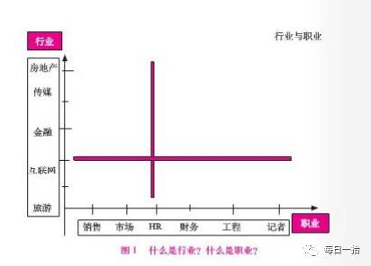

# 趋势的力量

最近又把《趋势的力量》翻了一遍，这本书我曾经推荐过一些学弟学妹，以及其他的一些朋友。今天再读，依然很受启发，现将书本中的一些观点，加上我自己的一些理解做简单的归纳，各位看官请先搬好小板凳拿好瓜子哦。

在文章开始前先问大家两个问题？
* 1、我们职业重要还是所处的行业重要？
* 2、选择重要还是努力重要，为什么？
       
看完这两个问题，相信各位看官已经知道我接下来要说的什么了。

## 行业与职业的关系
          
> 什么是行业？

行业是依附于人民大众社会生活的具体需要的内容而言。一般是指其按生产同类产品或具有相同工艺过程或提供同类劳动服务划分的经济活动类别，如饮食行业、服装行业、机械行业、金融行业、移动互联网行业等。
          
> 什么是职业？
       
所从事工作的工作形式的相同性而言，一般就是按照社会分工不同而划分。根据中国职业规划师协会的定义：职业=职能*行业，这样才能算是一个完整的职业。

* 行业是内容，内容方向不一样，道路也不同，方向也不同。
* 行业的范围比职业广，先有了行业才衍生出职业。
* 行业的发展趋势决定了未来所处的位置（马车、报纸等等）

由上图我们可以看到职业与行业交汇点就标示了一段时间内一个人的职业定位。一个清晰的职业定位是未来打算在什么行业从事什么职业。

行业的选择同时也决定了职业类型。古语有云：“男怕入错行，女怕嫁错郎”，就可以看出行业的重要性，所以如果方向（行业或者职业）错误，越努力，离成功也越远。

## 如何去选行业
        
由上我们知道了职业与行业的关系，那么我们该如何去选择我们的行业呢？在回答这些问题之前我们先思考一个问题。二十年前、今天、以及二十年后的热门行业会是什么呢？

当前的社会，我们每一个人的命运与时代是息息相关的。从辛亥革命到新中国成立，这一个动荡的年代，将军辈出，这个时代是将才的时代。从改革开放到下海经商潮，这个时代是个体经营，制造业的时代。从房地产到互联网，再到当前的移动互联网，每一次产业的变更，带动的不仅是社会的变动，也是行业的发展变更。故我们为了不在社会发展中退伍，也必须知道如何去选择一个长期发展的行业。
        
行业发展一般都是周期性的。其周期性一般可以归纳为：初创、快速成长、稳定、衰替四个阶段。如果从竞争格局上看也可以划分为：跑马圈地、自由竞争、春秋战国、寡头垄断四个阶段。

一个行业的发展都离不开资本推动的力量，每个行业内都有新兴的细分行业代表未来的发展趋势。故未来的热门行业很大概率将会出现在更细分的领域。人工智能、生物科学、智慧医疗等等不一而足。下图是美国200年来的行业变更图：

## 如何取选取职业

进入此阶段，证明你已经选择好行业了，那么我们如何选择我们的职业呢？小编不打算直接回答你的问题，而以互联网行业为例，附上IDG资本、红杉中国、经纬创投、创新工厂等几个投资公司近几年的投资方向的图表(图片均来自：股权转让研究中心，版权归原作者所有)

通过上面的几幅图，相信各位看官或多或少，对互联网行业的未来发展趋势有一个详细的了解了。下面说一下我们在选取职业时可以采取的策略：

> 借力资本的风向标，看资本的流动情况

资本是要获利的，所以资本总在不停的去寻找符合人们真实需求的新兴行业。虽然资本也有失败的时候，但是各大投资机构掌握着比我们更多的资本、水平更高的投资的经理，更多的资源，所以他们的眼光是可以作为我们的选取的标的物的。

> 行业前三名（大企业）

此时行业已经进入寡头垄断阶段。而众所周知行业发展遵循“二八原则”（不懂什么叫二八原则的可以度一下），行业前三名的企业是在稳定的“势”之上，经过长期竞争博弈形成的格局。这种格局能够在一个相对长期的过程中保持稳定。

> 选未来（选择中小企业）

从具有发展潜力的细分行业中去选。一个高速发展的新兴行业中存在高速成长的中小型企业，我们在发挥创新创意能力的同时可以伴随行业、企业的高速发展获取丰厚的回报。

## 总结
* 1、职业的选择是战术层面，而行业则是战略层面，只有战略正确，战术才有意义。
* 2、选择重要还是努力重要。当然是选择重要，方向如果错误，越努力，你离成功越远。至于如何选择，请参考二、三关于如何选择行业以及职业的部分。
以上仅是本人的一点拙见，欢迎大家拍砖。
